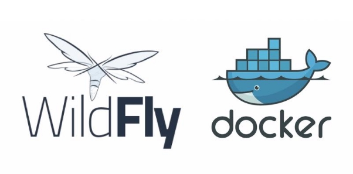
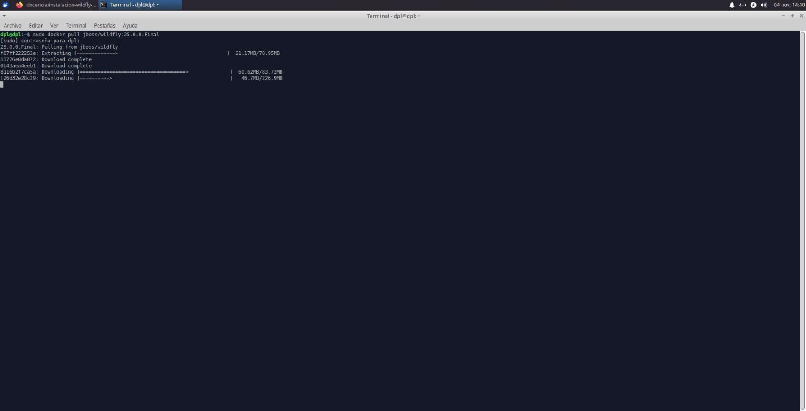
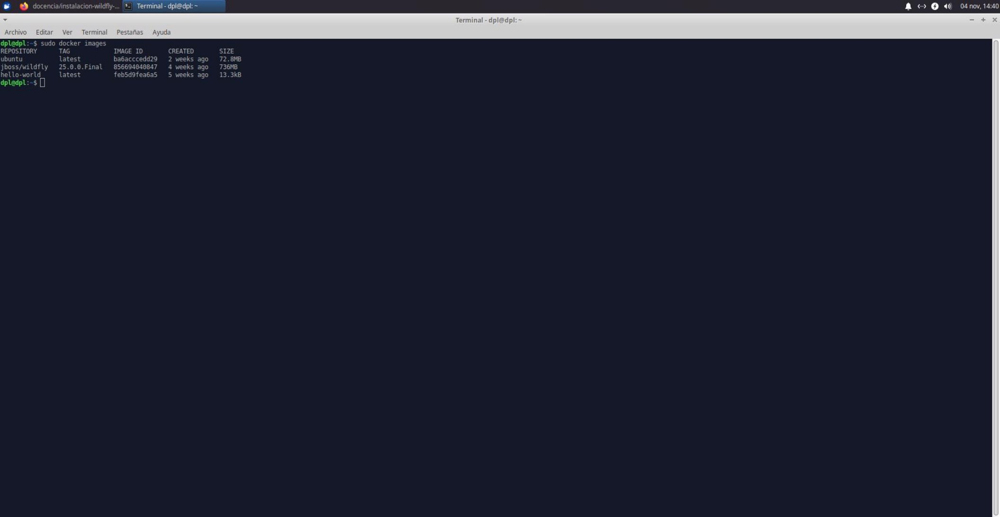
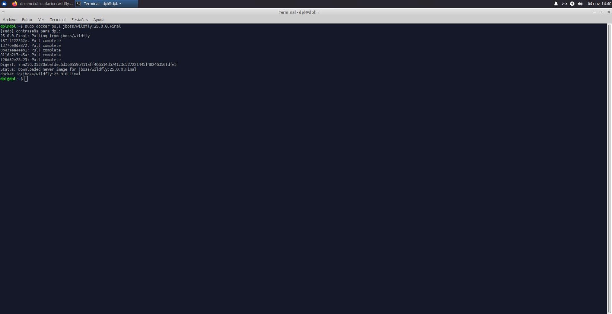
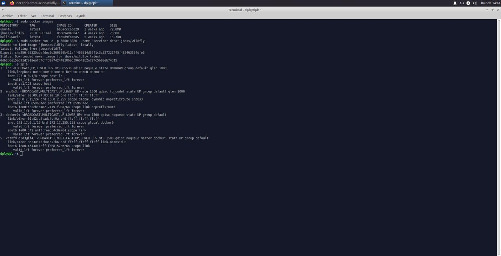
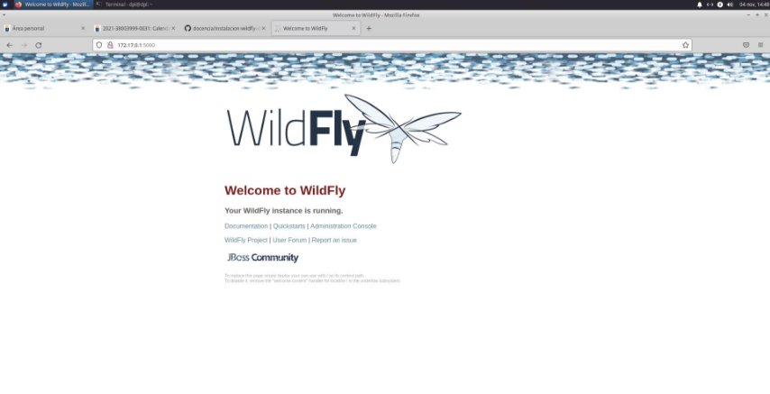

Despliegue WildFly en Docker

**Índice**

- Descarga de la imagen del docker WildFly
- Comprobación del servicio

**Descarga de la imagen de docker WildFly**

- Primero debemos de descargar nuestra imagen docker de WildFly
- Seguidamente verificamos las imágenes descargadas en nuestro sistema
- Ahora procedemos a arrancar nuestro contenedor de Wildfly con el siguiente comando:

sudo docker run -d -p 5000:8080 --name "servidor-desa" jboss/wildfly

- Donde:
  - -d arranca el servidor en el background
  - -p 5000:8080 especifica el puerto 8080 y el host 5000 (nuestra máquina)
  - --name “servidor-desa” Define el alias para nuestro contenedor

**Comprobación del servicio**

- A continuación verificamos la ip asignada a docker y verificamos que nuestro servidor se haya desplegado
Cristo Javier Garcia Martín 2º DAW

DPL
