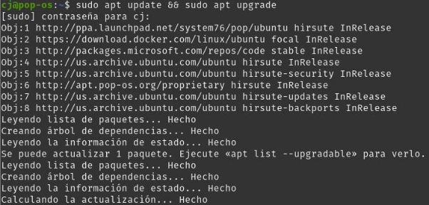

Desplegar una aplicación en Node.js en Docker

Índice

- Preparación del entorno
- Creación de Node.js
- Creación de ficheros de Docker
- Construcción y despliegue de la imagen

Preparación del entorno

- Primero debemos de actualizar la máquina, y comprobar que tenemos node instalado

Creación de Node.js

- Contenido del fichero package.json

- Contenido server.js

Creación de ficheros de docker

- Contenido Dockerfile

- Contenido .dockerignore

Construcción y despliegue de la imagen

- Construimos la imagen con el siguiente comando:
  - sudo docker build . -t cj/node-web-app

- Y desplegamos la imagen con el siguiente comando:
  - sudo docker run -p 49160:8080 -d cj/node-web-app

- Para finalizar, podemos probar la aplicación accediendo a localhost:49160:

Cristo Javier García Martín 2º DAW

DPL
