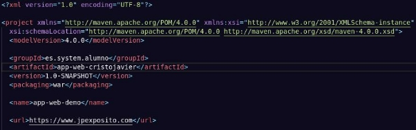

Despliegue War en Apache Tomcat

Índice

- Requisitos previos
- Modificación del proyecto en java
- Despliegue en tomcat

Requisitos Previos

- Previamente, debemos de tener instalado Maven en el equipo, con el siguiente comando:
  - sudo apt install maven

Modificación del Proyecto en Java

- Debemos de modificar los siguientes archivos en el proyecto:
  - web.xml

- index.jsp

- pom.xml

Despliegue en Tomcat

- Para desplegar nuestra aplicación en tomcat, debemos de copiar el archivo .war en la carpeta webapps, además de configurar un usuario de tomcat:
  - Copiamos el archivo .war en webapps

- Y para comprobar el despliegue de la aplicación, es tan sencillo como acceder a la siguiente url:
  - <http://localhost:8085/app-web-demo/>

Cristo Javier García Martín 2º DAW

DPL
