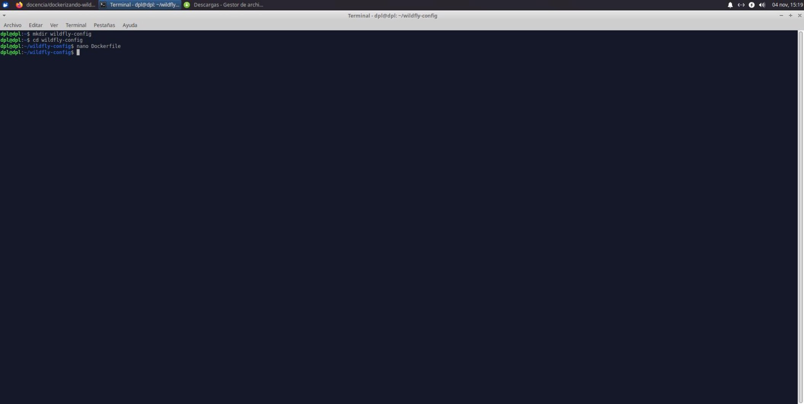
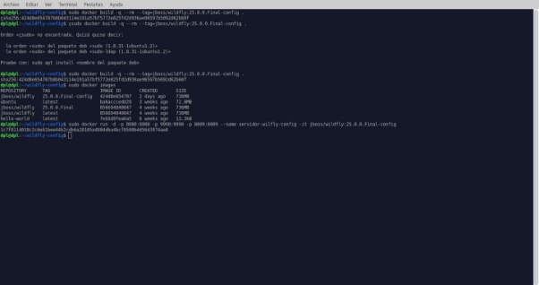
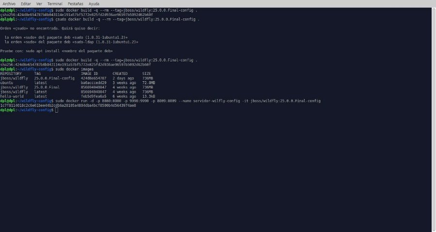

**Dockerizando Wildfly**

**Índice**

- Creación del fichero para Wildfly
- Uso de la nueva imagen

**Creación del fichero**

- Creamos el directorio de nuestra imagen y configuramos nuestro fichero de configuración con el siguiente contenido
- Base image

FROM jboss/wildfly:25.0.0.Final

- Maintainer

MAINTAINER "jpexposito" "mail@example.com"

- Create user admin with password admin

RUN /opt/jboss/wildfly/bin/add-user.sh admin admin --silent

- Add custom configuration file
- ADD standalone.xml /opt/jboss/wildfly/standalone/configuration/
- Add example.war to deployments
- ADD example.war /opt/jboss/wildfly/standalone/deployments/
- JBoss ports

EXPOSE 8080 9990 8009

- Run

CMD ["/opt/jboss/wildfly/bin/standalone.sh", "-b", "0.0.0.0", "-bmanagement", "0.0.0.0", "-c", "standalone.xml"]

- Seguidamente construcción de nuestra imagen

**Uso de nuestra imagen**

- A continuación usaremos nuestra imagen de la siguiente forma
Cristo Javier García Martín 2º DAW

DPL
