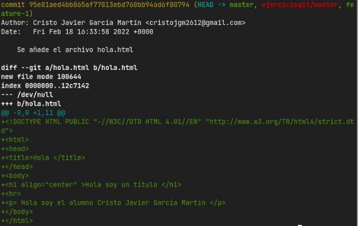

Ejercicio GIT

Índice

- Inicialización del repositorio
- Creación de los ficheros y ramas iniciales
- Merge de ambas ramas

Inicialización del repositorio

- Para comenzar, debemos de inicializar el repositorio con
  - git init
- Seguido de la creación del fichero README

Creación de los ficheros y ramas iniciales

- A continuación, creamos la rama feature-1 y el fichero hola.html
  - git checkout -b feature-1

- Luego, nos volvemos a cambiar a la rama master, y creamos el fichero adios.html

- Hacemos merge entre ambas ramas, y un push:
  - git merge feature-1

- git push ejerciciogit

\-

- Y mostramos el historial de nuestro repositorio

Cristo Javier García Martín 2º DAW

DPL
