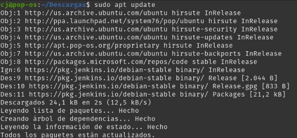
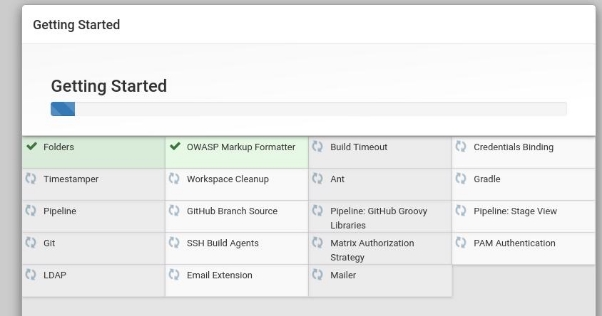
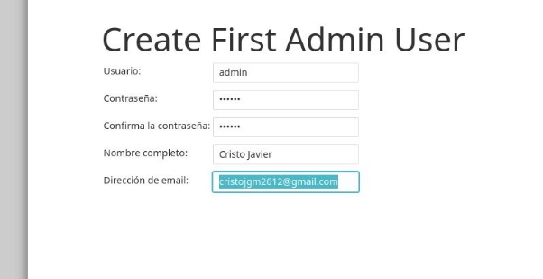
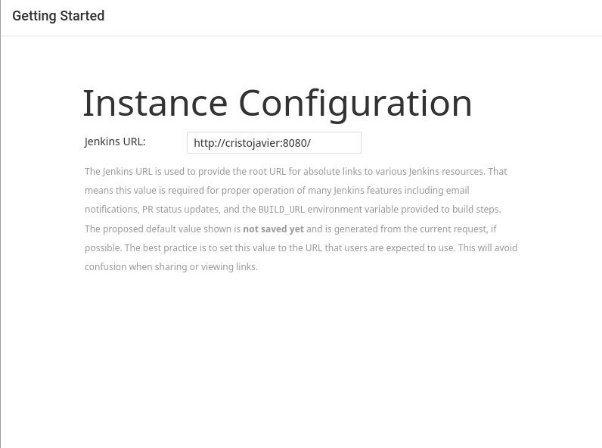
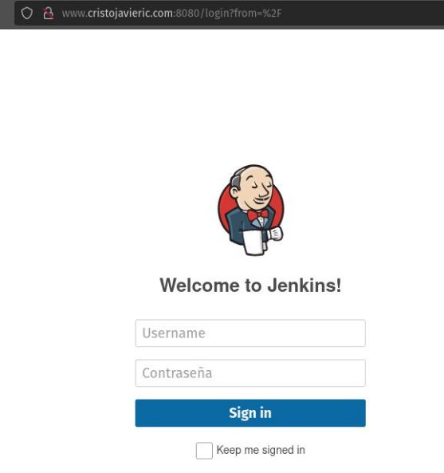

Instalación Jenkins

Instalar Jenkins

Primeramente debemos de añadir el repositorio oficial al sistema

- wget -q -O - https://pkg.jenkins.io/debian-stable/jenkins.io.key | sudo apt-key add

A continuación, añadimos la dirección del repositorio a las sources.list del servidor

- sudo sh -c 'echo deb http://pkg.jenkins.io/debian-stable binary/ > /etc/apt/sources.list.d/jenkins.list'

Seguidamente, actualizamos nuestro sistema e instalamos jenkins

Iniciar Jenkins

Para iniciar nuestro servicio de Jenkins es necesario el comando:

- sudo systemctl start jenkins

Y para comprobar el estado del servicio el comando:

- sudo systemctl status jenkins

Abrir el firewall

Debemos de activar y permitir tanto el puerto 8080 como OpenSSH, con los comandos

- sudo ufw allow 8080
- sudo ufw allow OpenSSH
- sudo ufw enable

Podemos comprobar el estado de las nuevas reglas con:

- sudo ufw status

Configurar Jenkins

Para configurar Jenkins debemos de acceder a nuestro localhost:8080 e introducir la contraseña guardada en /var/lib/jenkins/secrets/initialAdminPassword

- sudo cat /var/lib/jenkins/secrets/initialAdminPassword

Seguidamente la introducimos en la página de Jenkins y accedemos a la configuración

Dejamos que el propio programa instale lo recomendado

Creamos nuestro usuario de administración.

**IMPORTANTE:** Introducir un email real, pues Jenkins nos enviará informes de diagnóstico y errores al mismo

Introducimos nuestro dominio y habremos finalizado con la configuración

Probamos el mismo dominio, y damos por finalizada la instalación

Cristo Javier García Martín 2º DAW

DPL
