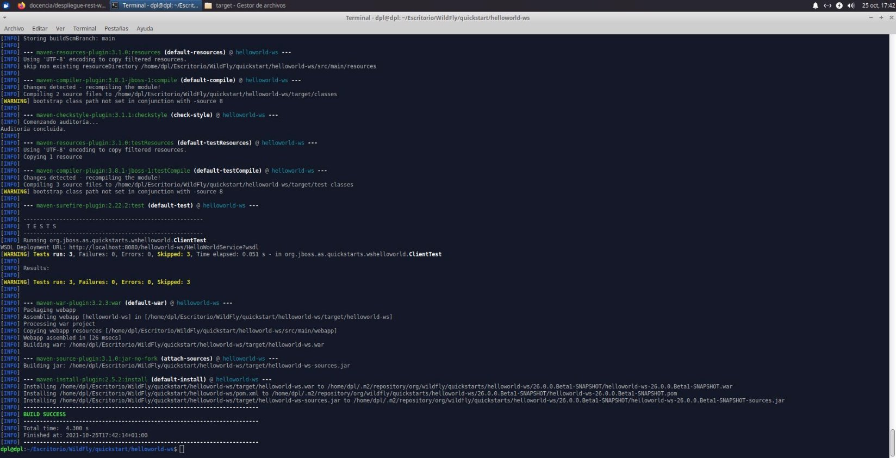

Índice

Instalación Servicios Rest

- Instalación de hellowolrd-rs
- Instalación de hellowolrd-ws
- Instalación de hellowolrd-rs
- Primero debemos de descargar el proyecto de github en el que se encuentra nuestro proyecto
- Seguidamente realizamos una instalación limpia dentro del directorio, y lo desplegamos en nuestro servidor WildFly

Cristo Javier García Martín 2º DAW

DPL

` `

Cristo Javier García Martín 2º DAW

DPL
Índice

- Instalación de hellowolrd-ws
- A continuación, nos desplazamos hasta el directorio helloworld-ws y repetimos los pasos anteriores
Cristo Javier García Martín 2º DAW

DPL
