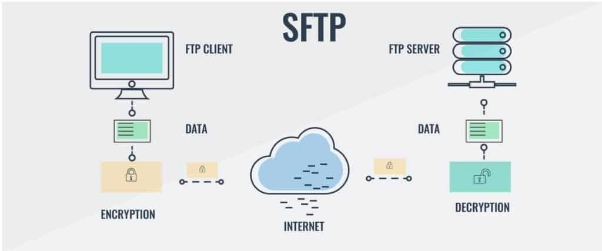

Instalación Servidor SFTP

Índice

- Instalación servidor SFTP
- Configuración Vsftpd.conf

Instalación servidor Sftp

- Primeramente, debemos de actualizar nuestra máquina.
  - sudo apt update && sudo apt upgrade

- Luego, instalamos el paquete vsftpd:
  - sudo apt install -y vsftpd

Configuración Vsftpd.conf

- Ahora, debemos de acceder al fichero de configuración de vsftpd.conf, situado en la carpeta /etc, y verificamos que tengamos las siguientes opciones habilitadas:
  - pasv\_enable=YES
  - pasv\_min\_port=30000
  - pasv\_max\_port=30050

- Recargamos el servidor, y lo probamos con el cliente filezilla:

- Accedemos al servidor con nuestro usuario y contraseña

Cristo Javier García Martín 2º DAW

DPL
