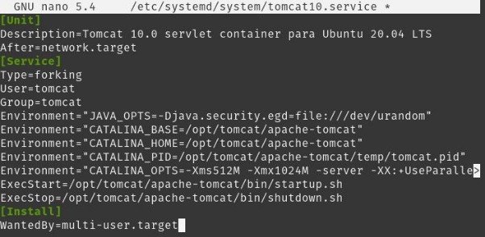
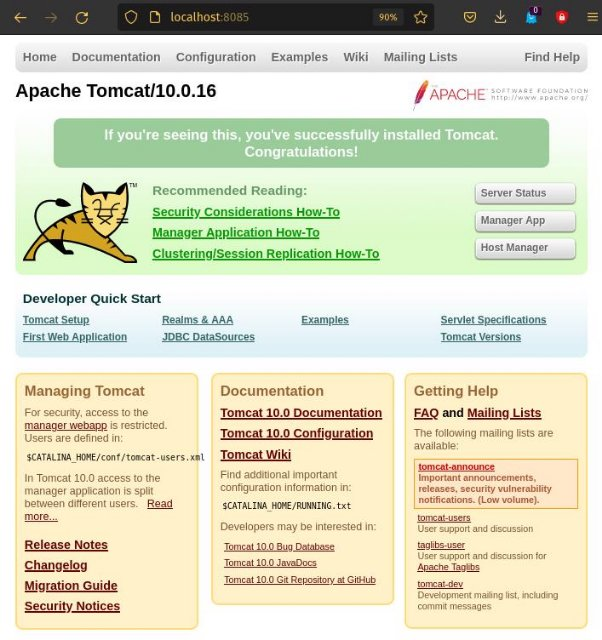

Instalación de Apache Tomcat

Índice

- Requisitos Previos
- Instalación en local

Requisitos Previos

- Antes de empezar con la instalación, es necesario tener instalado java, lo haremos con el siguiente comando:
  - sudo apt install default-jdk

Instalación en local

- Luego de comprobar que disponemos de java, debemos de descargar el paquete desde la página oficial de apache
  - wget https://downloads.apache.org/tomcat/tomcat-10/v10.0.16/bin/ apache-tomcat-10.0.16.tar.gz

- Seguidamente, debemos de añadir nuestro usuario tomcat:
  - sudo useradd -U -m -d /opt/tomcat -k /dev/null -s /bin/false tomcat

- Y descomprimimos el archivo en su localización definitiva

- Ahora debemos de asignar como propietario de la carpeta, al usuario antes creado, y configuramos nuestro servicio tomat

- Podemos comprobar si hemos realizado el servicio de manera adecuada con los siguientes comandos:
  - sudo systemctl start tomcat10
  - sudo systemctl status tomcat10

- Cabe añadir, que he modificado el puerto de despliegue en el archivo server.xml

Cristo Javier García Martín 2º DAW

DPL
