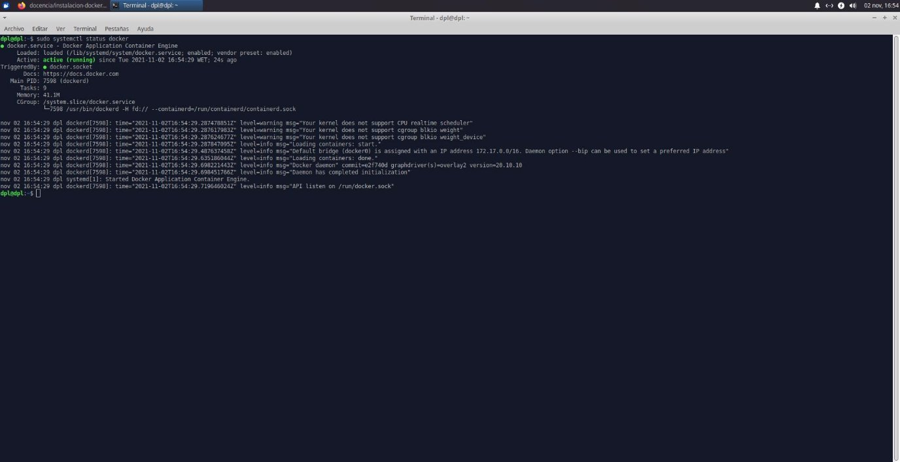

**Instalación de Docker**

**Índice**

- Preparación del entorno de trabajo
- Trabajar con imágenes de Docker
- Administrar contenedores de Docker

**Preparación del entorno de trabajo**

- Como siempre, primero debemos de actualizar nuestra máquina para empezar con la instalación
- A continuación, es necesario instalar unas cuantas dependencias necesarias para la instalación de docker
  - sudo apt install apt-transport-https ca-certificates curl software-properties-common
- También debemos de añadir la clave GPG para el repositorio oficial de Docker
- Agregamos el repositorio de Docker al sistema y actualizamos la máquina
- Ahora procedemos a instalar docker
- Comprobamos que el servicio se haya desplegado de manera correcta

**Trabajar con imágenes de docker**

- Ahora para probar docker, solo resta desplegar el siguiente comando
  - docker run hello-world
- Y así habremos desplegado nuestra primera aplicación con docker

**Administrar contenedores de docker**

- Con los comandos ps, ps-a y ps -l, veremos, en el mismo orden, los contenedores activos, activos e inactivos, y el último contenedor creado
- Y con docker images, se mostraran la nueva imagen, y la última de la que se derivó
Cristo Javier García Martín 2º DAW

DPL
