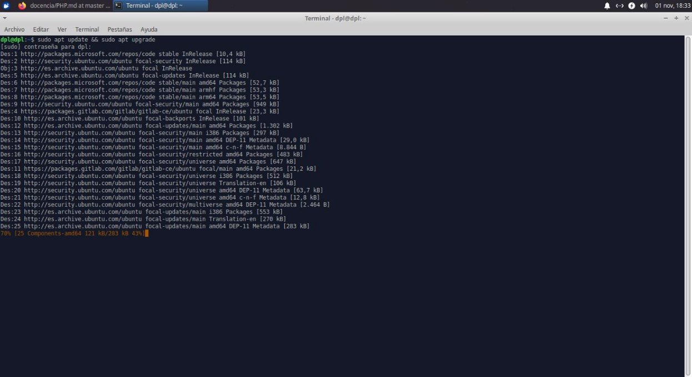
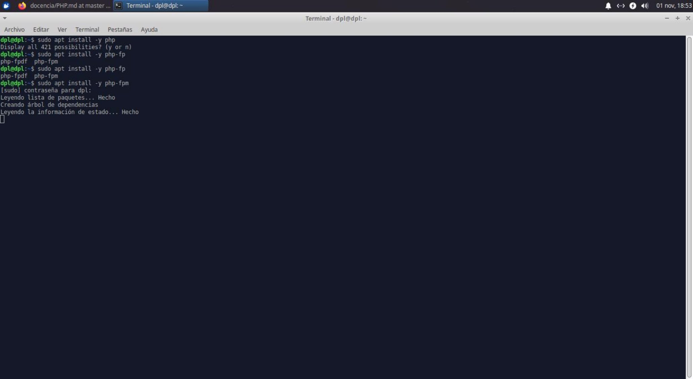
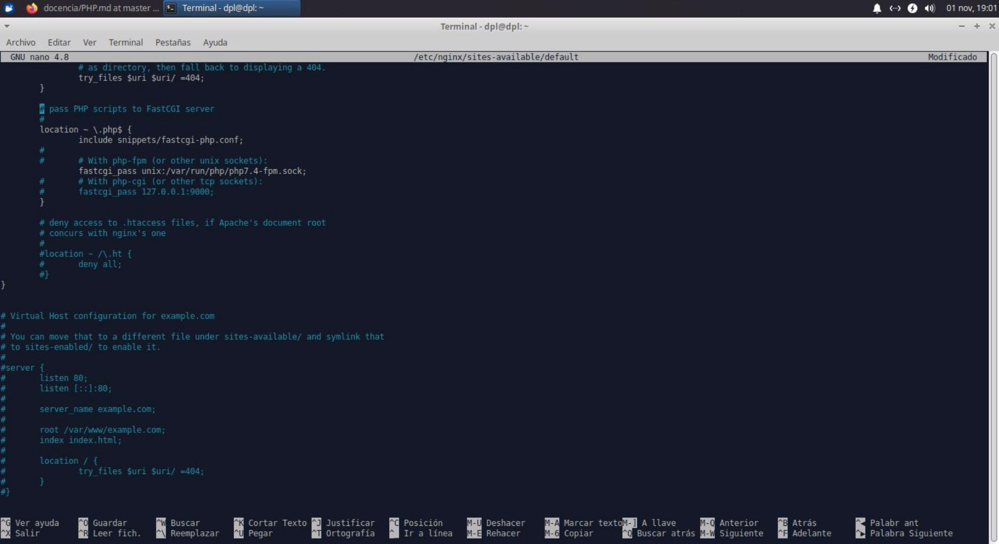
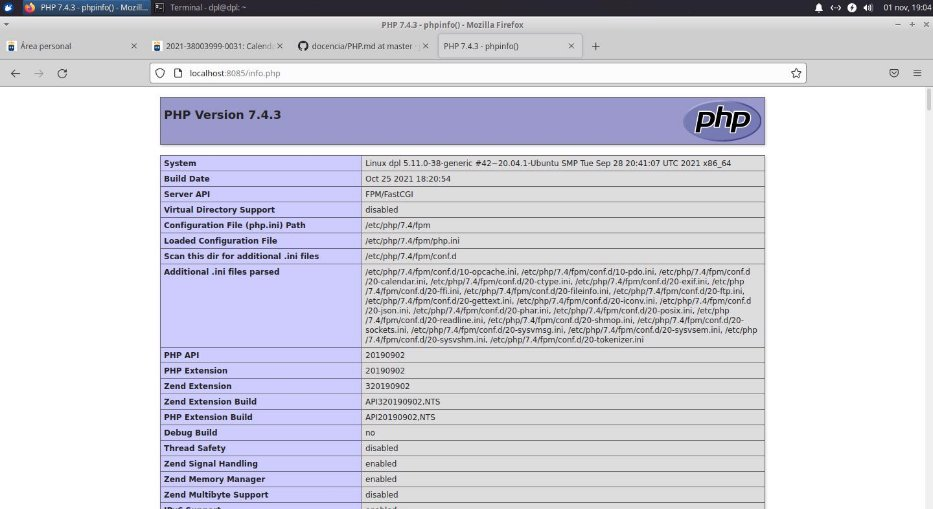

**Instalación de PHP en Nginx**

**Índice**

- Actualización de repositorios
- Instalación y configuración de PHP
- Comprobación de correcta instalación

**Actualización de repositorios**

- Para comenzar, actualizaremos nuestra máquina como ya es costumbre

**Instalación y configuración de PHP**

- A continuación, procederemos a instalar el paquete de PHP que necesitamos al usar nginx
- Seguidamente debemos de modificar el fichero situado en la carpeta
  - /etc/nginx/sites-available/default

**Comprobación de configuración**

- Ahora solo resta crear un fichero php con la siguiente línea <?php phpinfo(): ?>, en la carpeta /var/www/html/
Cristo Javier García Martín 2º DAW

DPL
