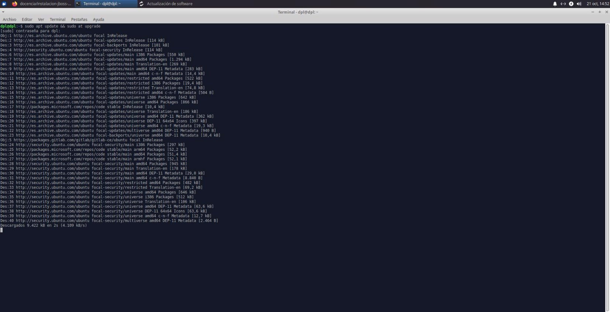
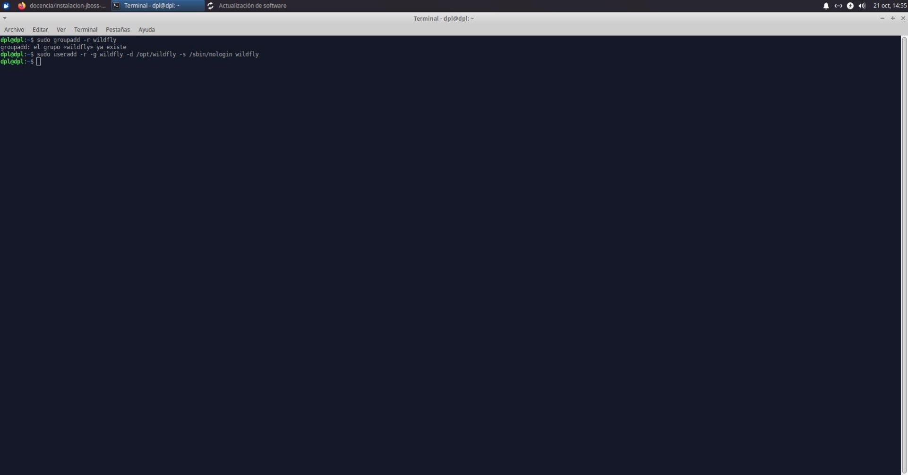
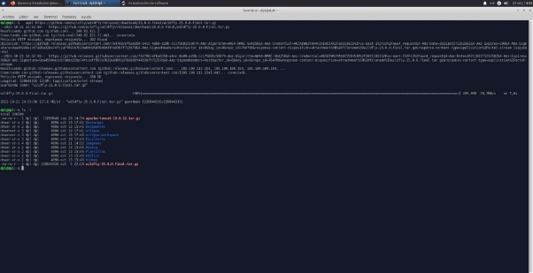
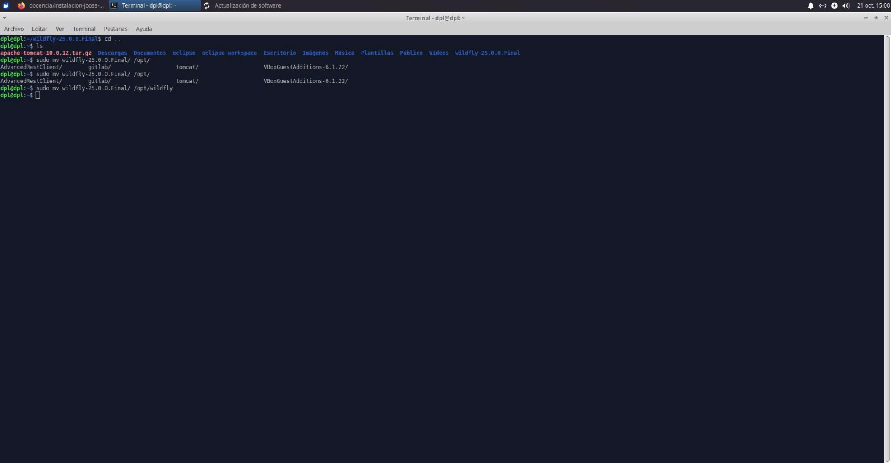
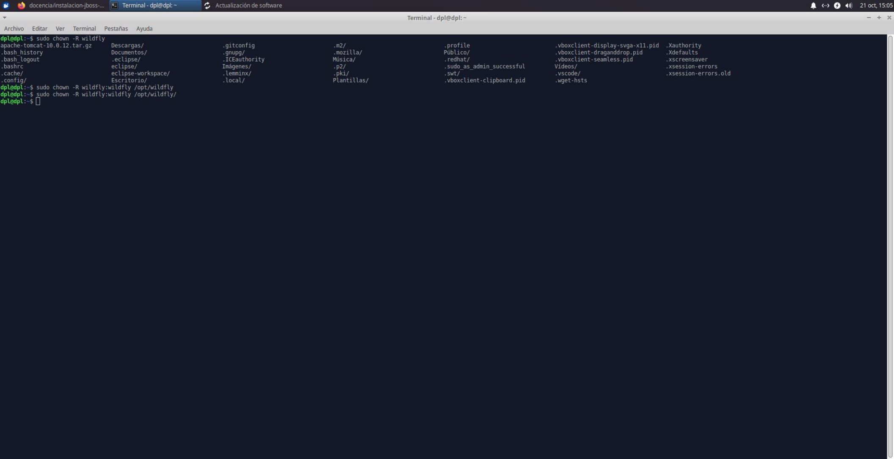
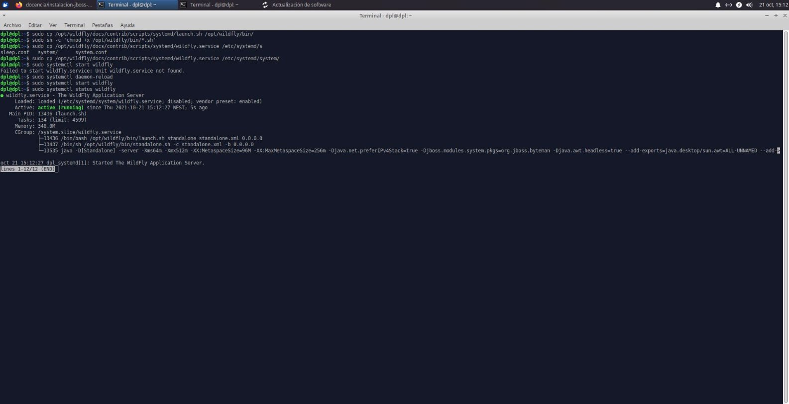
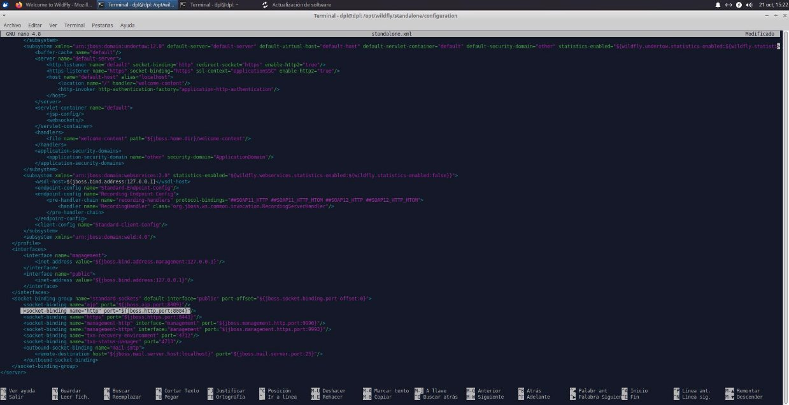
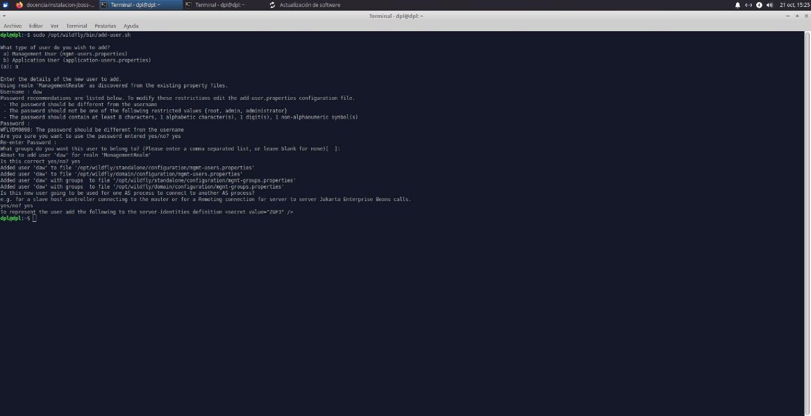

**JBoss-Wildfly**

**Índice**

- Requisitos previos
- Instalación de Wildfly en local
- Cómo añadir usuarios a Wildfly

**Requisitos Previos**

- Necesitarás un sistema Linux
- Java
- Maven

**Pasos para realizar la instalación en local**

- Primero, debemos de actualizar los repositorios de nuestro sistema
- A continuación, debemos de descargar nuestro paquete de WildFly
- Ahora crearemos el nuevo grupo y usuario wildfly:
- Descomprimimos el recién descargado paquete de Wildly y movemos a la carpeta de destino, en este caso /opt/wildfly
- Y creamos un enlace simbólico con el siguiente comando
- sudo ln -s /opt/wildfly-25.0.0.Final /opt/wildfly
- Además, otorgamos acceso al usuario y grupo wildfly
- Seguidamente, configuraremos el inicio del servidor con los siguientes comandos
- sudo mkdir -p /etc/wildfly
- sudo cp /opt/wildfly/docs/contrib/scripts/systemd/wildfly.conf /etc/wildfly/
- Procederemos con los siguientes comandos para terminar de configurar el arranque del servidor
- sudo cp /opt/wildfly/docs/contrib/scripts/systemd/launch.sh /opt/wildfly/bin/
- sudo sh -c 'chmod +x /opt/wildfly/bin/\*.sh'
- sudo cp /opt/wildfly/docs/contrib/scripts/systemd/wildfly.service /etc/systemd/system/
- sudo systemctl daemon-reload
- sudo systemctl restart wildfly.service
- Para terminar de configurar Wildfly, debemos de modificar el fichero de configuración y cambiar el rooteado de puertos al 8084:

**Cómo añadir usuario a Wildfly**

- Y para terminar, debemos de ejecutar el siguiente script
- sudo /opt/wildfly/bin/add-user.sh
Cristo Javier García Martín 2º DAW

DPL
