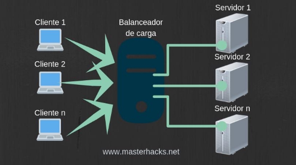
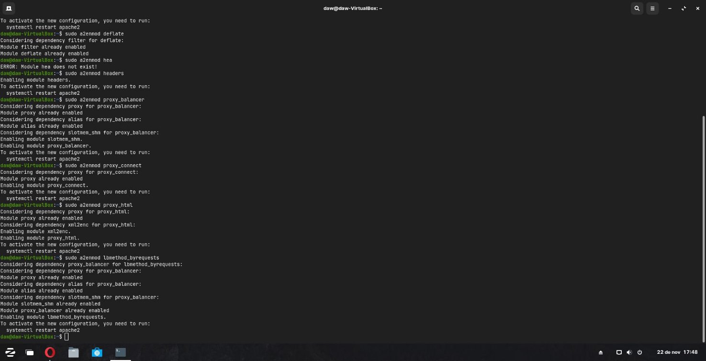
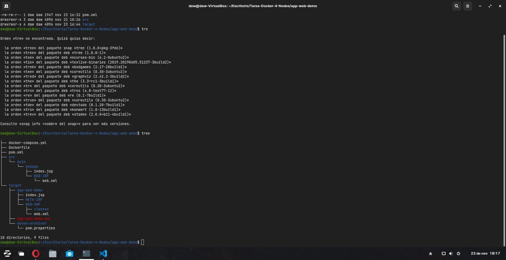
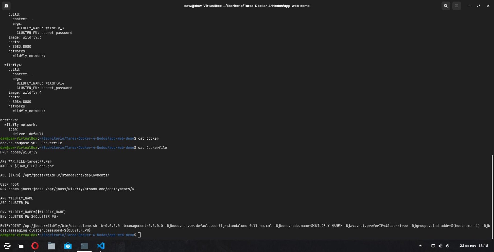
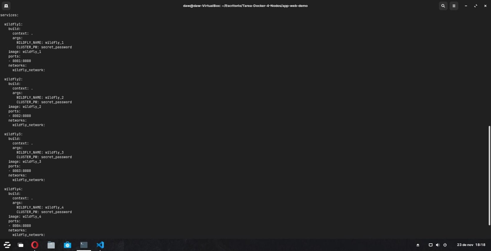
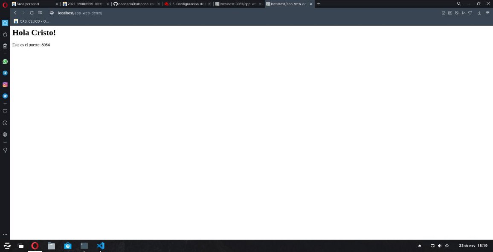

Despliegue de Servidor con balanceo de carga y 4 nodos +

Índice

- Activación de módulos necesarios en Apache
- Configuración de Apache

Activación de los módulos necesarios en Apache

- Para comenzar, debemos de activar los siguientes módulos en Apache:

a2enmod proxy

a2enmod proxy\_http

a2enmod proxy\_ajp

a2enmod rewrite

a2enmod deflate

a2enmod headers

a2enmod proxy\_balancer a2enmod proxy\_connect a2enmod proxy\_html

a2enmod lbmethod\_byrequests

Configuración de Apache

- Seguidamente debemos de configurar apache y añadir las siguientes líneas:

**Preparación del Proyecto**

- Nos descargamos el repositorio de la asignatura e instalamos las dependecias con
  - mvn clean install

**Configuración de Dockerfile y docker-compose.yml**

- Ahora debemos de configurar de la siguiente forma tanto el Dockerfile, como el docker-compose.yml
- Dockerfile
- docker-compose.yml
- Levantamos el servicio con sudo docker-compose up -d, y revisamos la siguiente dirección

localhost/app-web-demo
Cristo Javier García Martín 2º DAW

DPL
