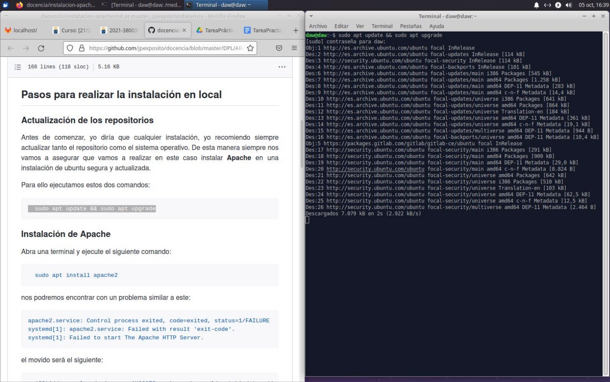
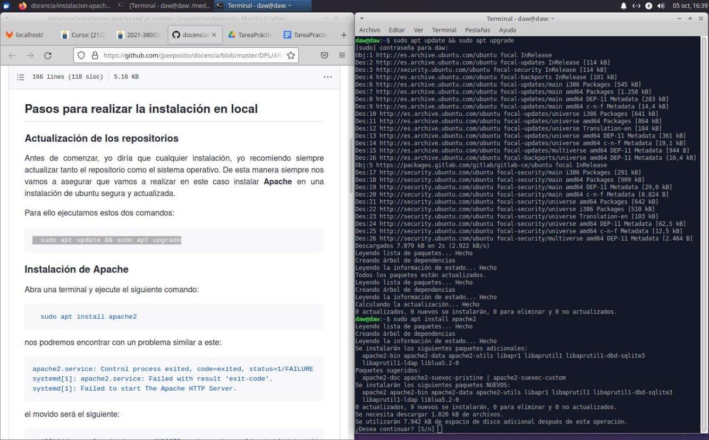
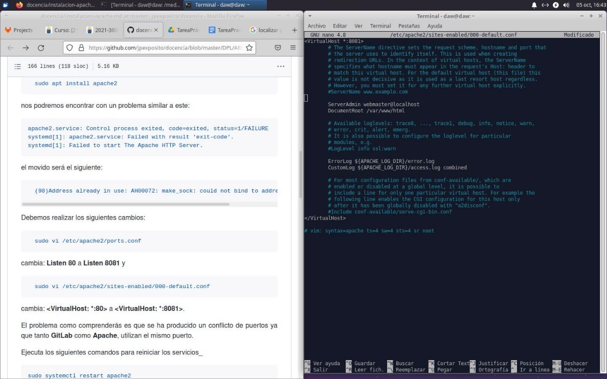
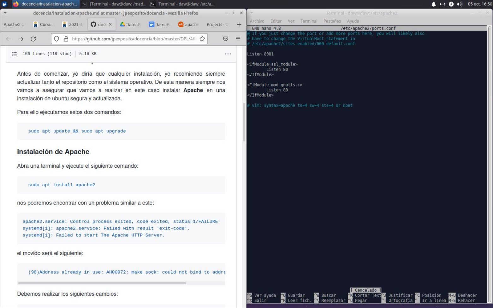
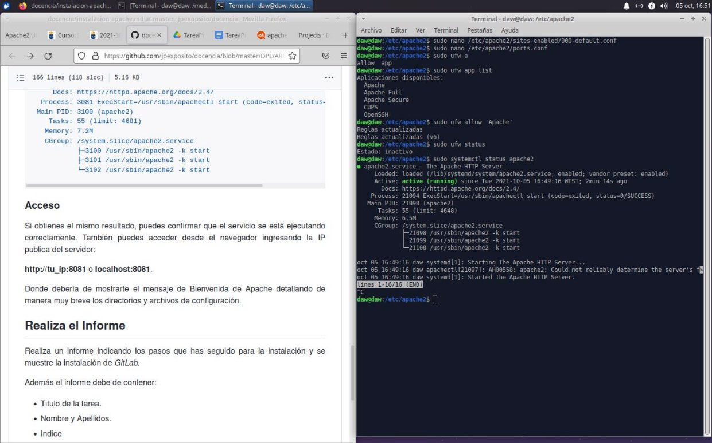
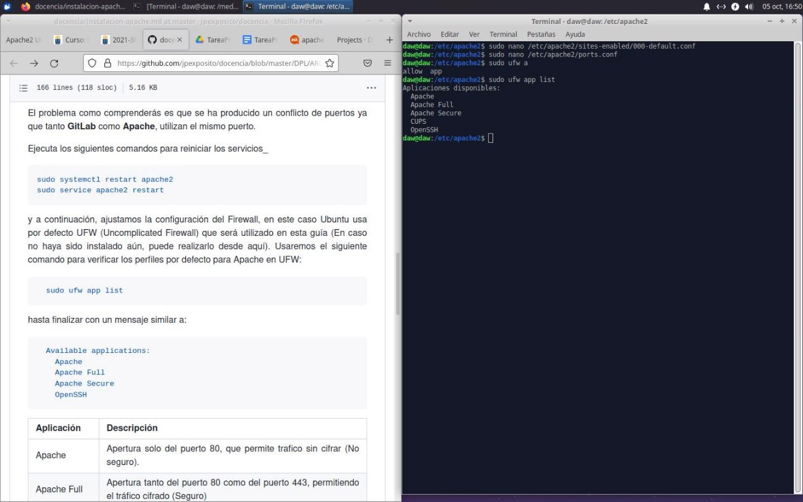

Instalación Apache en linux

Índice

- Actualización de los repositorios
- Instalación de Apache
- Acceso

Actualización de los repositorios

- Para comenzar con la práctica, debemos de actualizar tanto el repositorio como el sistema operativo que estemos usando. En el caso de linux, serían los siguientes comandos:
  - sudo apt update && sudo apt upgrade

Instalación de Apache

- A continuación instalaremos apache teniendo en cuenta que dará error, pues ya tenemos Gitlab instalado y, de forma nativa, ambos usan el mismo puerto, por lo que tendremos que configurar los puertos de apache. Yo utilicé el 8081, en vez del 80 que viene por defecto y es el nativo tanto de Apache como Gitlab
  - sudo apt install apache2

Acceso

- Luego de configurar los puertos, reiniciamos apache y revisamos la configuración de firewall con los siguientes comandos
  - sudo systemctl restart apache2
  - sudo ufw app list
Cristo Javier García Martín 2º DAW

Despliegue de aplicaciones Web
