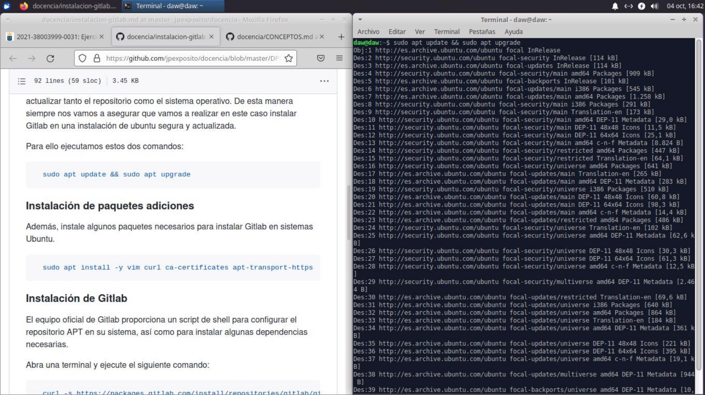
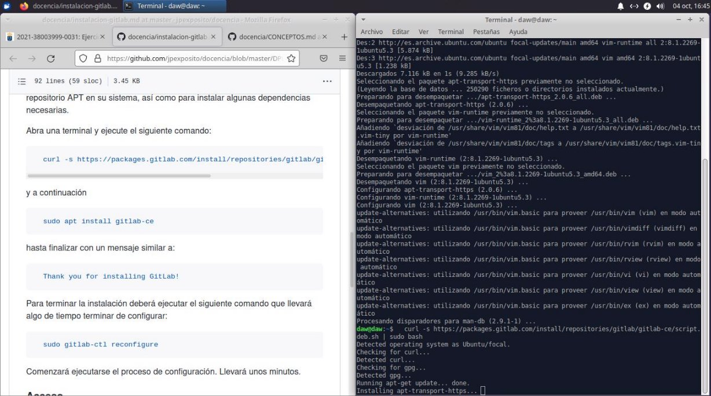
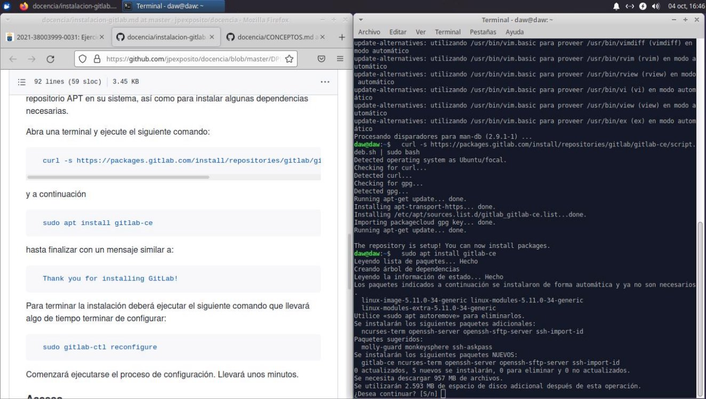
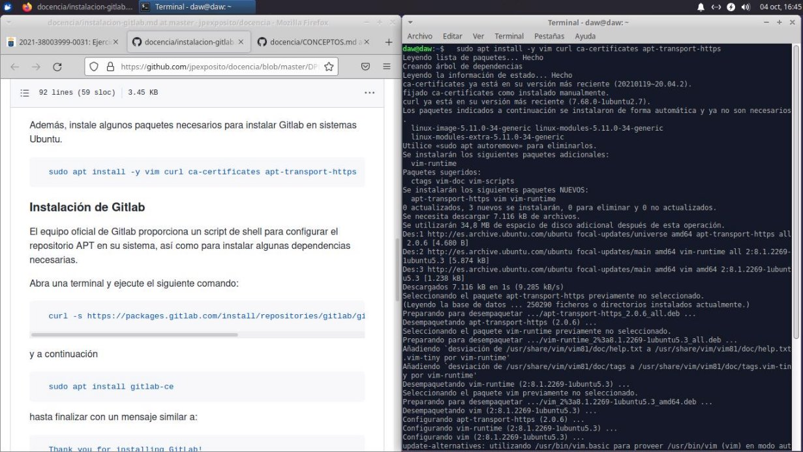
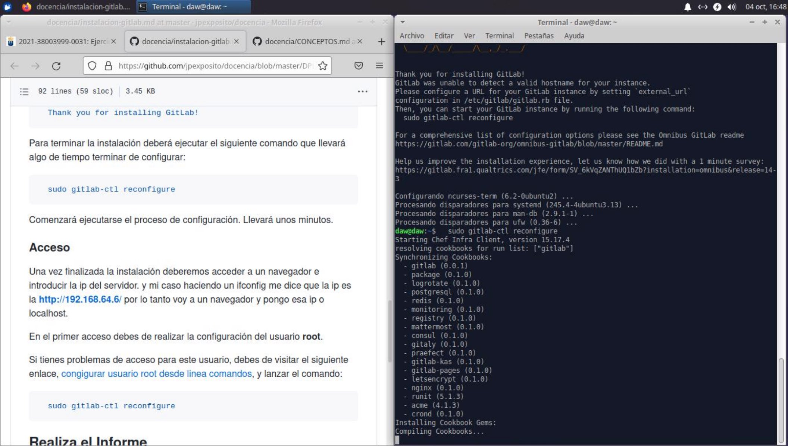
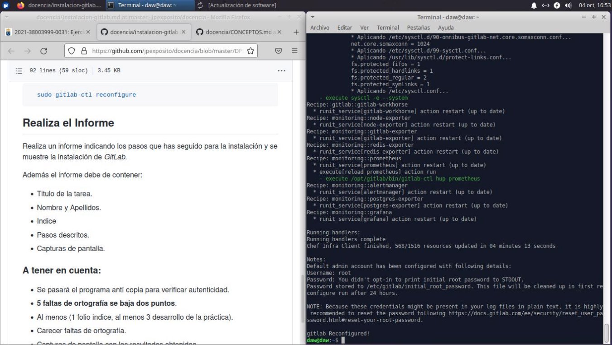

Instalación Git Lab

Índice

- Actualización de los repositorios
- Ejercicio Instalación de paquetes adicionales
- Instalación de Gitlab
- Acceso

Actualización de los repositorios

- Para comenzar con la práctica, debemos de actualizar tanto el repositorio como el sistema operativo que estemos usando. En el caso de linux, serían los siguientes comandos:
  - sudo apt update && sudo apt upgrade

Instalación de paquetes adicionales

- Ahora debemos de instalar unos paquetes adicionales necesarios para la instalación de Gitlab en sistemas Ubuntu:
  - sudo apt install -y vim curl ca-certificates apt-transport-https

Instalación de Gitlab

- La instalación la realizaremos mediante el propio script que nos proporciona el equipo de Gitlab. Ejecutaremos el siguiente comando
  - curl -s https://packages.gitlab.com/install/repositories/gitlab/gitlab-ce/sc ript.deb.sh | sudo bash
- Seguido de
  - sudo apt install gitlab-ce
- Para terminar con la instalación debemos de ejecutar el siguiente comando y habremos finalizado
  - sudo gitlab-ctl reconfigure
Cristo Javier García Martín 2º DAW

Despliegue de Aplicaciones Web
