Manipulación Avanzada de Repositorios GIT

Índice

- Configuración
- Ejercicio 1
- Ejercicio 2
- Ejercicio 3
- Ejercicio 4
- Ejercicio 5
- Ejercicio 6
- Ejercicio 7
- Ejercicio 8
- Ejercicio 9

Configuración

- Primeramente debemos de clonar nuestro repositorio it desde el siguiente enlace: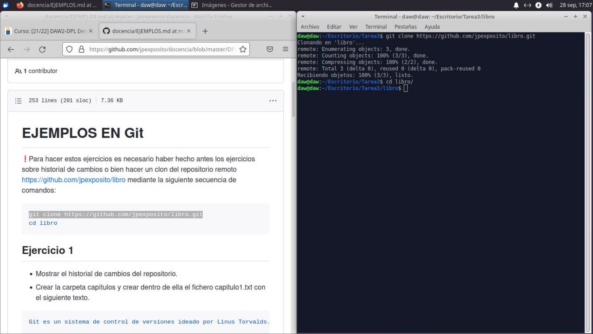

<https://github.com/jexposito/libro.git>

Cristo Javier García Martín 2º DAW

Despliegue de Aplicaciones Web
Ejercicio PAGE4

- Seguidamente, mostraremos el historial de cambios del repositorio, y crearemos la carpeta **capitulos**, donde trabajaremos a lo largo de la práctica, y dentro de la misma, un fichero de texto de nombre **capitulo1.txt**, con el siguiente contenido

Git es un sistema de control de versiones ideado por Linus Torvalds.

Añadimos los cambios a la zona de intercambio temporal, seguido de un commit con el mensaje ‘Añadido capítulo 1’, y volvemos a mostrar el historial de cambios del repositorio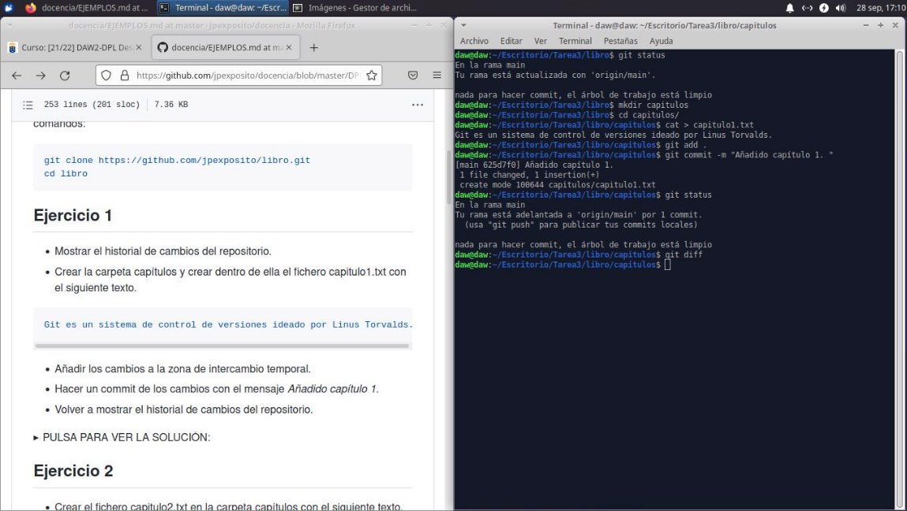

.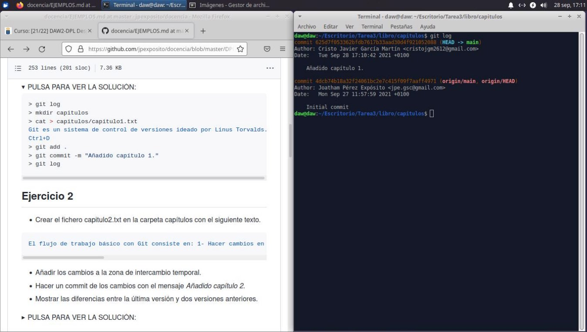

- Ahora, crearemos el fichero **capitulo2.txt** con el siguiente texto:

El flujo de trabajo básico con Git consiste en: 1- Hacer cambios en el repositorio. 2- Añadir los cambios a la zona de intercambio temporal. 3- Hacer un commit de los cambios.

- Añadiremos como en el paso anterior, los cambios a la zona temporal, seguido de un commit con el mensaje ‘Añadido capítulo 2’, y mostramos las diferencias entre las diferentes versiones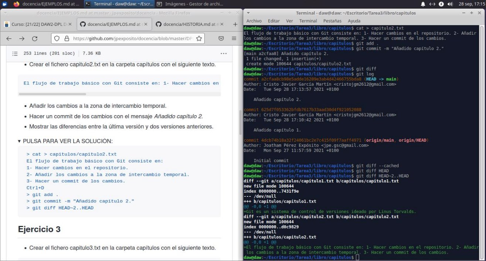
- Proseguiremos con la creación del fichero **capitulo3.txt** con el siguiente texto:
  - Git permite la creación de ramas lo que permite tener distintas versiones del mismo proyecto y trabajar de manera simultanea en ellas.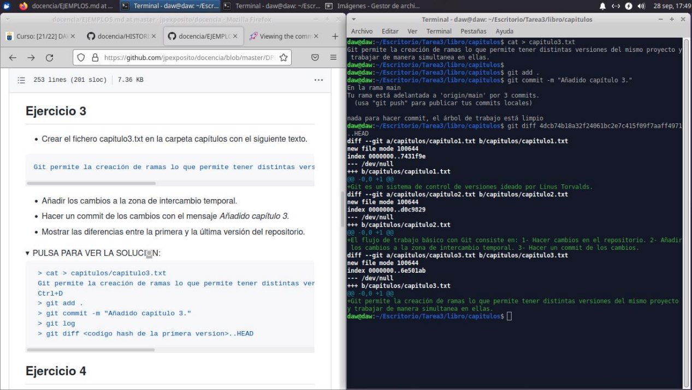
- Volvemos a añadir los cambios a la zona de intercambio temporal, y realizamos un commit con el mensaje ‘Añadido capítulo 3’
- Mostramos las diferencias entre la primera y la última versión del repositorio
- En este paso, creamos el fichero **indice.txt** la siguiente línea:
  - Índice de los capítulos, con conceptos avanzados de git
- Añadimos los cambios a la zona de intercambio temporal y realizamos un commit con el siguiente mensaje: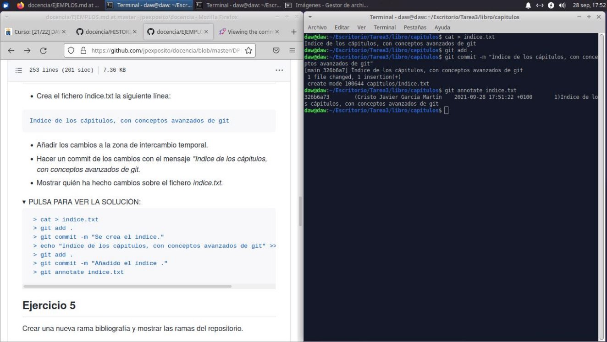
  - ‘Índice de los capítulos, con conceptos avanzados de git.’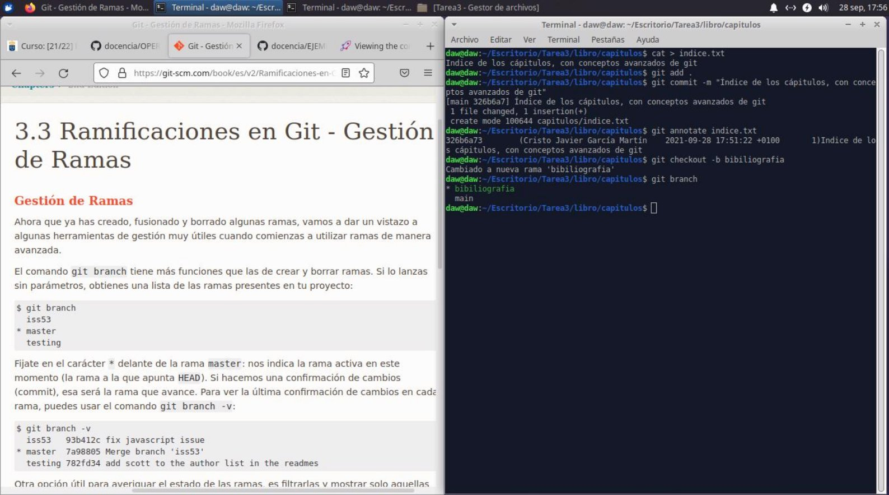
- Y mostramos quién ha realizado cambios en el fichero indice.txt

Ejercicio 5

- Creamos un a nueva rama llamada **bibliografia**, y mostramos el resto de ramas del repositorio

Cristo Javier García Martín 2º DAW

Despliegue de Aplicaciones Web
Ejercicio = PAGE4 + 59

- Creamos el fichero **capitulo4.txt** con el siguiente contenido.
  - En este capítulo veremos cómo usar GitHub para alojar repositorios en remoto.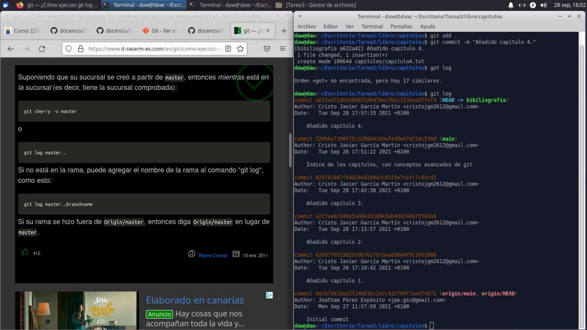
- Añadimos los cambios a la zona temporal, y realizamos un commit con el mensaje ‘Añadido capítulo 4’
- Mostramos todos los cambios del repositorio incluyendo todas las ramas
- Cambiamos a la rama bibliografia, y creamos el fichero **bibliografia.txt** y añadimos las siguientes referencias
  - Chacon, S. and Straub, B. Pro Git. Apress.
- Añadimos los cambios a la zona de intercambio temporal y realizamos un commit con el mensaje ‘Añadida primera referencia bibliográfica’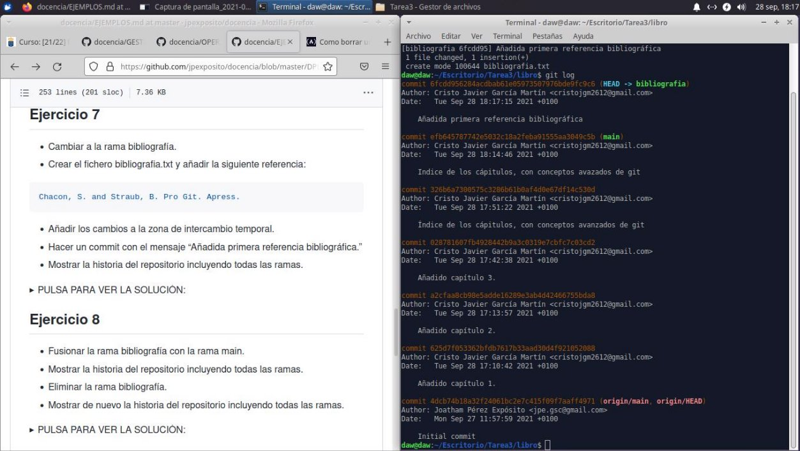
- Mostramos todos los cambios del repositorio incluyendo todas las ramas
- Fusionamos ambas ramas del repositorio git en la rama main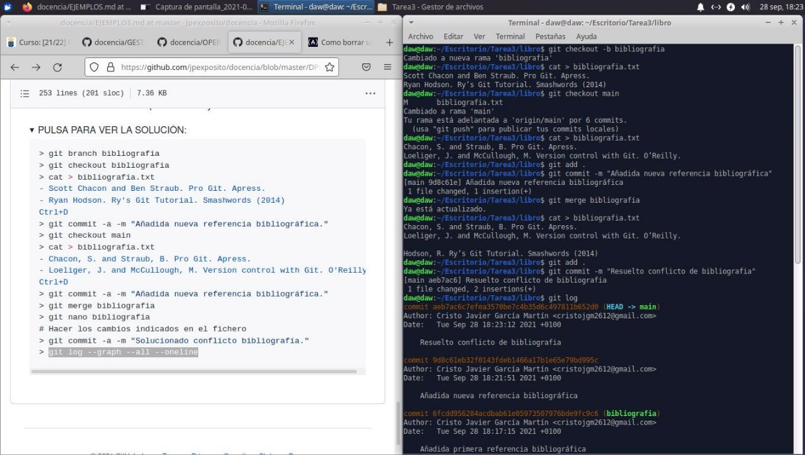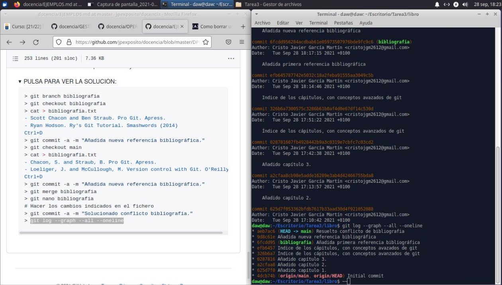
- Mostramos la historia al completo del repositorio y eliminamos la rama bibliografia
- Mostramos de nuevo la historia del repositorio al completo
- Creamos y cambiamos de nuevo la rama **bibliografia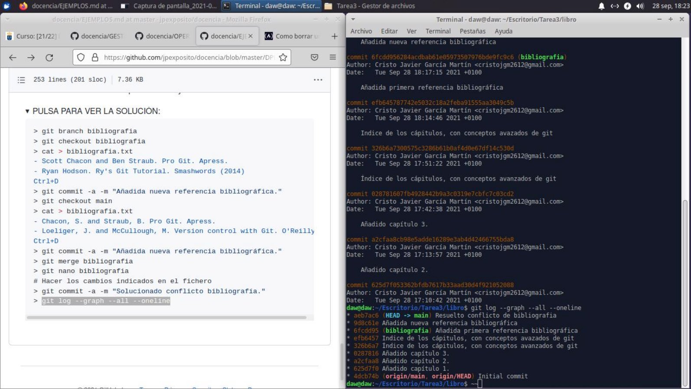**
- Cambiamos el contenido del fichero bibliografia.txt al siguiente:
  - Scott Chacon and Ben Straub. Pro Git. Apress.
  - Ryan Hodson. Ry’s Git Tutorial. Smashwords (2014)
- Cambiamos a la rama main y volvemos a cambiar el fichero bibliografia al siguiente:
  - Chacon, S. and Straub, B. Pro Git. Apress.
  - Loeliger, J. and McCullough, M. Version control with Git. O’Reilly.
- Añadimos los cambios a la zona de intercambio temporal y realizamos un commit con el mensaje ‘Añadida nueva referencia bibliográfica’
- Fusionamos la rama bibliografia con la rama main y resolvemos los conflictos dejando el archivo bibliografia.txt con las siguientes referencias
  - Chacon, S. and Straub, B. Pro Git. Apress.
  - Loeliger, J. and McCullough, M. Version control with Git. O’Reilly.
  - Hodson, R. Ry’s Git Tutorial. Smashwords (2014)
- Añadimos todos los cambios a la zona de intercambio temporal y realizamos un commit con el mensaje ‘Resuelto conflicto de bibliografía’

\-
Cristo Javier García Martín 2º DAW

Despliegue de Aplicaciones Web
